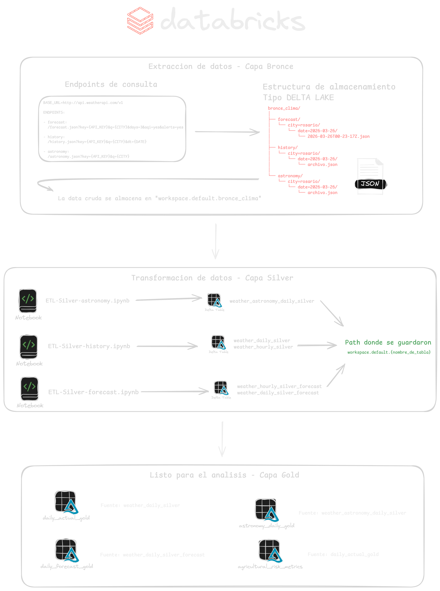
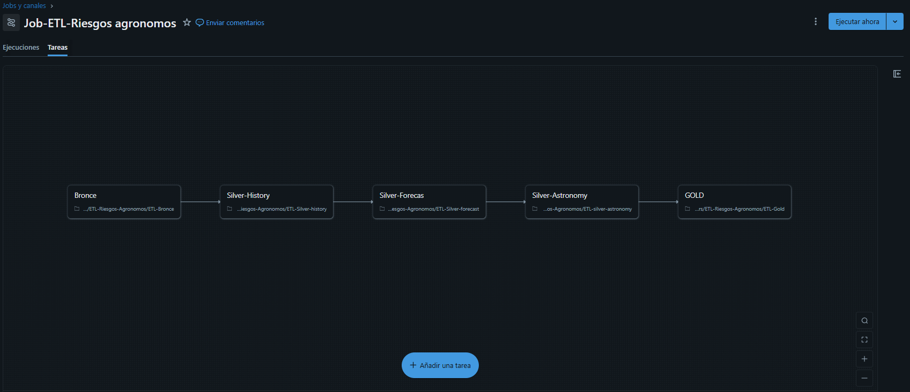
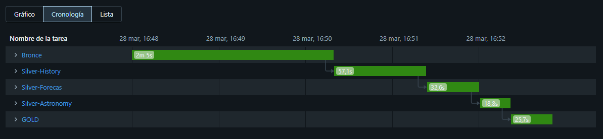

## ETL – Riesgos Agronómicos (Databricks | Medallion)

Proyecto de **Data Engineering (nivel junior)** en Databricks que ingiere datos climáticos desde **WeatherAPI** y construye un modelo **Bronze → Silver → Gold** en **Delta Lake** para habilitar métricas de riesgos agronómicos (heladas, tormentas, ventana de siembra, etc.).

---

## Objetivo
- Ingestar datos **raw** (JSON) desde WeatherAPI para múltiples ciudades.
- Normalizar y deduplicar datos en **Silver** (tablas Delta).
- Publicar **Gold** con métricas listas para análisis y dashboards.

---

## Arquitectura (Medallion)

### Bronze (Raw JSON)
- **Qué es**: datos crudos sin transformar, enriquecidos con metadata.
- **Fuente**: WeatherAPI
  - `forecast` (pronóstico)
  - `history` (histórico del día)
  - `astronomy` (astronomía)
- **Almacenamiento (ruta)**:
  - Base: `/Volumes/workspace/default/bronce_clima`
  - Estructura (por endpoint / ciudad / fecha):
    - `/forecast/city=<city_normalizada>/date=<YYYY-MM-DD>/<timestamp>.json`
    - `/history/city=<city_normalizada>/date=<YYYY-MM-DD>/<timestamp>.json`
    - `/astronomy/city=<city_normalizada>/date=<YYYY-MM-DD>/<timestamp>.json`
  - Errores:
    - `/Volumes/workspace/default/bronce_clima/_errors/<timestamp>_<city>_<endpoint>*.json`

**Notebook**: `ETL-Bronce.ipynb`

**Metadata incluida en Bronze** (dentro de cada JSON):
- `metadata.ciudad`
- `metadata.endpoint`
- `metadata.ingestion_time` (UTC)
- `metadata.source`

---

### Silver (Tablas Delta normalizadas)
- **Qué es**: tablas normalizadas (1 fila por clave lógica) con tipos consistentes y deduplicación por `ingestion_time`.
- **Almacenamiento**: **tablas Delta gestionadas** en Databricks (`saveAsTable(...)`).

#### Tablas Silver creadas
1) **`weather_daily_silver`**
- **Grano**: `city + date`
- **Origen**: Bronze `history`
- **Contenido**: métricas diarias (Tmax, Tmin, precip, viento, humedad, condición, etc.)
- **Deduplicación**: `row_number() over (partition by city,date order by ingestion_time desc)`

2) **`weather_hourly_silver`**
- **Grano**: `city + datetime`
- **Origen**: Bronze `history` (`forecastday.hour`)
- **Contenido**: métricas horarias (temp, humedad, precip, viento, cloud, condición)
- **Deduplicación**: `city + datetime` por `ingestion_time` más reciente

3) **`weather_daily_silver_forecast`**
- **Grano**: `city + date`
- **Origen**: Bronze `forecast`
- **Contenido**: métricas diarias pronosticadas (incluye `uv`)
- **Deduplicación**: `city + date` por `ingestion_time` más reciente

4) **`weather_hourly_silver_forecast`**
- **Grano**: `city + time`
- **Origen**: Bronze `forecast` (horario)
- **Contenido**: métricas horarias pronosticadas (temp, precip, wind, humidity, cloud, chance_of_rain, will_it_rain, uv, etc.)
- **Notas**:
  - `time` se castea a timestamp
  - `date` se deriva desde `time`
  - se extrae `hour` (0–23)
- **Deduplicación**: `city + time` por `ingestion_time` más reciente

5) **`weather_astronomy_daily_silver`**
- **Grano**: `city + date`
- **Origen**: Bronze `astronomy`
- **Columnas finales (persistidas)**:
  - `city`, `date`, `ingestion_time`
  - `sunrise_ts`, `sunset_ts`
  - `moonrise`, `moonset`, `moon_phase`, `moon_illumination`
- **Deduplicación**: `city + date` por `ingestion_time` más reciente

**Notebooks**:
- `ETL-Silver-history.ipynb`
- `ETL-Silver-forecast.ipynb`
- `ETL-silver-astronomy.ipynb`

---

### Gold (Métricas listas para análisis)
- **Qué es**: tablas con métricas de negocio y campos derivados para consumo analítico.
- **Almacenamiento**: **tablas Delta gestionadas** (`saveAsTable(...)`).

#### Tablas Gold creadas

1) **`daily_actual_gold`**
- **Grano**: `city + date`
- **Fuente**: `weather_daily_silver`
- **Campos derivados**:
  - `temp_range = maxtemp_c - mintemp_c`
  - `dry_day = (totalprecip_mm = 0)`
  - `frost_risk`:
    - Alto si `mintemp_c < 2` y `maxwind_kph < 15`
    - Moderado si `mintemp_c < 2`
    - Bajo caso contrario
  - `gdd_daily = max(0, ((maxtemp_c + mintemp_c)/2) - 10)` (Tbase=10 por defecto)

2) **`daily_forecast_gold`**
- **Grano**: `city + date`
- **Fuente**: `weather_daily_silver_forecast`
- **Campos derivados**:
  - `temp_range = maxtemp_c - mintemp_c`
  - `frost_risk` (misma lógica que actual)
  - `sowing_window`:
    - Óptimo si `avghumidity > 60` y `daily_chance_of_rain < 30` y `totalprecip_mm < 10`
    - Marginal si `avghumidity > 50` y `daily_chance_of_rain < 50`
    - No apto caso contrario

3) **`astronomy_daily_gold`**
- **Grano**: `city + date`
- **Fuente**: `weather_astronomy_daily_silver`
- **Campos derivados**:
  - `day_length_hours = (sunset_ts - sunrise_ts) / 3600`
  - (en tu Gold) se crean timestamps auxiliares como `moonrise_ts` y `moonset_ts` combinando `date + moonrise/moonset`

4) **`agricultural_risk_metrics`**
- **Grano**: `city + date`
- **Fuente**: `daily_actual_gold` + agregado diario calculado desde `weather_hourly_silver`
- **Agregados horarios (por `city,date`)**:
  - `max_hourly_precip = max(precip_mm)`
  - `max_hourly_wind = max(wind_kph)`
  - `fungal_hours = sum( humidity > 80 AND temp_c between 15 and 25 )`
- **Riesgo de tormenta** (según agregados horarios):
  - Alto: `max_hourly_precip > 10` y `max_hourly_wind > 40`
  - Moderado: `max_hourly_precip > 5` y `max_hourly_wind > 30`
  - Bajo: caso contrario

**Notebook**: `ETL-Gold.ipynb`

> Para más detalle de esquemas, ver `documentacion.md`.

---

## Cómo ejecutarlo en Databricks (orden recomendado)
1. `ETL-Bronce.ipynb` (ingesta raw desde API)
2. `ETL-Silver-history.ipynb`
3. `ETL-Silver-forecast.ipynb`
4. `ETL-silver-astronomy.ipynb`
5. `ETL-Gold.ipynb`

### Parámetros / configuración
- `ETL-Bronce.ipynb` usa widget:
  - `api_key` (WeatherAPI)
- Lista de ciudades: definida en el notebook Bronze y normalizada a `snake_case` (sin tildes).

---
## Captura de pantalla del JOB de databricks y su ejecución exitosa.

## Notas y mejoras futuras (portfolio)
- Actualmente varias escrituras usan `mode("overwrite")`. Próximo paso: incrementalidad por `date` (MERGE / overwrite por partición).
- Agregar auditoría por corrida (tabla `etl_audit_runs`) + reglas básicas de data quality.
- Reemplazar API key por Databricks Secrets (Secret Scope) y usar HTTPS.

---

## Autor
- Nombre y apellido: Lanzetti Fabrizio
- LinkedIn: www.linkedin.com/in/fabrizio-lanzetti-751116339

